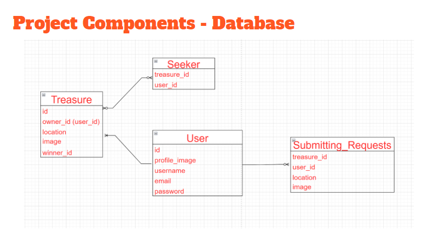

  

# Welcome to TreasureFind

TreasureFind is a multiplayer hybrid physical-virtual space 21st-century style of "hide and seek" revamped.

# Game Rules
- The hider chooses a “treasure”, takes a photo of it and creates a new game session.
- The seekers with the hint photo have to find and use their phone to take another picture of the “treasure” in order to win the game.
- The winner (one of seekers) will be determined by the host (hider) selecting one of submitted photos.
- The score for each seeker will be calculated based on whether the “treasure” is the right one and based on the proximity of the seeker from the “treasure”.
- The score for each hider will be calculated based on the number of seekers’ submissions.

Constraint: the seekers only can submit the photos while the host(hider) is also online.

# Why is it worth approaching?
A small and fun game for icebreaking utilizing modern technology to recreate a revamped 21st century style of Hide and Seek. It integrates both virtual and physical aspects to infuse greater physical activity in children and adults preserving the oral tradition of hide and seek through an untraditional method.

# Progress
[Project Pitch](https://www.youtube.com/watch?v=uAAD43q4c9c)

[Show and Tell 1](https://www.youtube.com/watch?v=jzxiTeOsli0)

[Show and Tell 2](https://www.youtube.com/watch?v=ZVXECAWutzU)

# Release
Please check out [the release page](https://github.com/eddyspaghette/TreasureFind/releases/tag/official) here and download the latest release.

# System Architecture
## App Flow

## MVVM

## Threaded Diagram

## Database

## Workload Distribute

For more details on the workload, please refer [here](https://github.com/eddyspaghette/TreasureFind/issues?page=1&q=is%3Aissue+is%3Aclosed).
